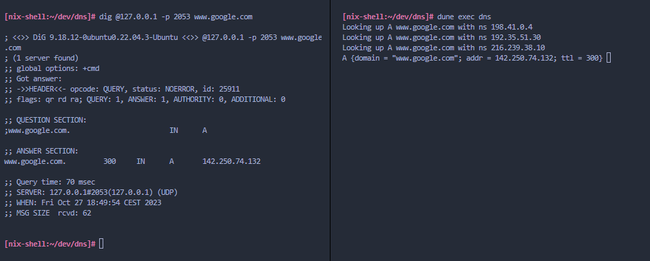

# How to run

I use nix, specifically nix-shell, simply run:

```console
nix-shell --max-jobs auto
```

A new shell will (after a long build time the first time, sorry) open with all necessary dependencies to build and run the server.

To run (within nix-shell):

```console
dune exec dns --release
```

To install nix follow: [nix install dosc](https://nixos.org/download)

If you would rather use dune directly instead of nix then you need to install the dependencies manually. Try ```dune build``` and install the libraries that give errors.

## How does the protocol work?

A good and detailed overview is [rfc standard](https://www.ietf.org/rfc/rfc1035.txt). The standard can be hard to follow at times but the actual packet layout is well explained.

The resolver itself can handle the following query types:
```ocaml
type t =
  | UNKOWN of int
  | A
  | NS
  | CNAME
  | MX
  | AAAA
[@@deriving show { with_path = false }]
```
So IPv4 and IPv6 is supported.

## How to use the server

Once server is built and running, simply open a new terminal and run:

```console
dig @127.0.0.1 -p 2053 google.com
```

Of course, you can query for any website you'd like, google.com is just an example.

