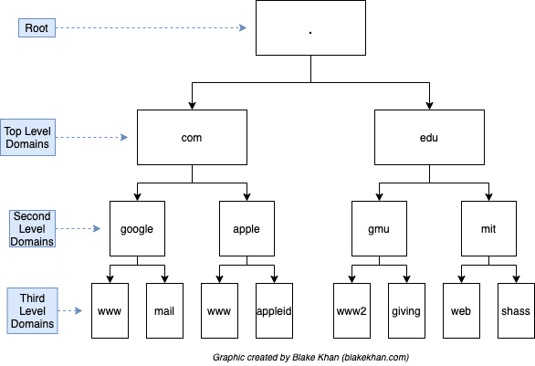

# Domain Name System (DNS)
In broad terms DNS is a distributed key-value store of domains (and its sub-domains) to IP adresses. Where a domain may be "google.com" and an IP adress is something alike "172.26.208.1".

Therefore the mapping may simply look like:
google.com -> 172.26.208.1  
github.com -> 140.82.121.4  
and so on ...

Now a [recursive resolver](https://linux.die.net/man/1/dig) does exactly this, when you type a domain into your browser a resolver has go through this distributed key-value store to find the IP adress there isn't one place with one huge mapping. This is where the distributed part comes in, when the resolver is trying to find the IP adress it will more than likely need to traverse many servers to find all the information it needs. It may be easier to think of this structure as an tree



Resolvers can then be thought of as a interface for querying the DNS distributed database, which is stored on *nameservers*. Thinking of the DNS namespace as a tree, each nameserver is an *authority* for a given subtree, each of which is called a *zone*. 

Looking at the above picture, you can then traverse the tree to get www.google.com. (where the last '.' is the root, or the 'end'). The search start at the root and continues down the tree, there are well known and 'always online' nameservers for the root zone.

Lets try to use [dig](https://linux.die.net/man/1/dig) manually to get an understanding of what is happening more precisely.

By running ```dig @198.41.0.4 www.google.com.```, we get something similar to:

```console
; <<>> DiG 9.18.12-0ubuntu0.22.04.1-Ubuntu <<>> @198.41.0.4 www.google.com.
; (1 server found)
;; global options: +cmd
;; Got answer:
;; ->>HEADER<<- opcode: QUERY, status: NOERROR, id: 32605
;; flags: qr rd; QUERY: 1, ANSWER: 0, AUTHORITY: 13, ADDITIONAL: 27
;; WARNING: recursion requested but not available

;; OPT PSEUDOSECTION:
; EDNS: version: 0, flags:; udp: 4096
;; QUESTION SECTION:
;www.google.com.                        IN      A

;; AUTHORITY SECTION:
com.                    172800  IN      NS      e.gtld-servers.net.
com.                    172800  IN      NS      b.gtld-servers.net.
com.                    172800  IN      NS      j.gtld-servers.net.
com.                    172800  IN      NS      m.gtld-servers.net.
com.                    172800  IN      NS      i.gtld-servers.net.
com.                    172800  IN      NS      f.gtld-servers.net.
com.                    172800  IN      NS      a.gtld-servers.net.
com.                    172800  IN      NS      g.gtld-servers.net.
com.                    172800  IN      NS      h.gtld-servers.net.
com.                    172800  IN      NS      l.gtld-servers.net.
com.                    172800  IN      NS      k.gtld-servers.net.
com.                    172800  IN      NS      c.gtld-servers.net.
com.                    172800  IN      NS      d.gtld-servers.net.

;; ADDITIONAL SECTION:
e.gtld-servers.net.     172800  IN      A       192.12.94.30
e.gtld-servers.net.     172800  IN      AAAA    2001:502:1ca1::30
b.gtld-servers.net.     172800  IN      A       192.33.14.30
b.gtld-servers.net.     172800  IN      AAAA    2001:503:231d::2:30
j.gtld-servers.net.     172800  IN      A       192.48.79.30
j.gtld-servers.net.     172800  IN      AAAA    2001:502:7094::30
m.gtld-servers.net.     172800  IN      A       192.55.83.30
m.gtld-servers.net.     172800  IN      AAAA    2001:501:b1f9::30
i.gtld-servers.net.     172800  IN      A       192.43.172.30
i.gtld-servers.net.     172800  IN      AAAA    2001:503:39c1::30
f.gtld-servers.net.     172800  IN      A       192.35.51.30
f.gtld-servers.net.     172800  IN      AAAA    2001:503:d414::30
a.gtld-servers.net.     172800  IN      A       192.5.6.30
a.gtld-servers.net.     172800  IN      AAAA    2001:503:a83e::2:30
g.gtld-servers.net.     172800  IN      A       192.42.93.30
g.gtld-servers.net.     172800  IN      AAAA    2001:503:eea3::30
h.gtld-servers.net.     172800  IN      A       192.54.112.30
h.gtld-servers.net.     172800  IN      AAAA    2001:502:8cc::30
l.gtld-servers.net.     172800  IN      A       192.41.162.30
l.gtld-servers.net.     172800  IN      AAAA    2001:500:d937::30
k.gtld-servers.net.     172800  IN      A       192.52.178.30
k.gtld-servers.net.     172800  IN      AAAA    2001:503:d2d::30
c.gtld-servers.net.     172800  IN      A       192.26.92.30
c.gtld-servers.net.     172800  IN      AAAA    2001:503:83eb::30
d.gtld-servers.net.     172800  IN      A       192.31.80.30
d.gtld-servers.net.     172800  IN      AAAA    2001:500:856e::30

;; Query time: 739 msec
;; SERVER: 198.41.0.4#53(198.41.0.4) (UDP)
;; WHEN: Thu Jul 27 20:15:54 CEST 2023
;; MSG SIZE  rcvd: 839
```

That's alot, but what dig is essentially telling is is that it sent a query for www.google.com. but the root nameserver (198.41.0.4) does not have the entire answer. Instead it responds with a list of nameservers that are in charge of the com. zone.

Okey so lets follow the tree structure then, pick a nameserver from the list and send a query, I'll pick 192.12.94.30.

```dig @192.12.94.30 www.google.com.``` then resturns:

```console
; <<>> DiG 9.18.12-0ubuntu0.22.04.1-Ubuntu <<>> @192.12.94.30 www.google.com.
; (1 server found)
;; global options: +cmd
;; Got answer:
;; ->>HEADER<<- opcode: QUERY, status: NOERROR, id: 45286
;; flags: qr rd; QUERY: 1, ANSWER: 0, AUTHORITY: 4, ADDITIONAL: 9
;; WARNING: recursion requested but not available

;; OPT PSEUDOSECTION:
; EDNS: version: 0, flags:; udp: 4096
;; QUESTION SECTION:
;www.google.com.                        IN      A

;; AUTHORITY SECTION:
google.com.             172800  IN      NS      ns2.google.com.
google.com.             172800  IN      NS      ns1.google.com.
google.com.             172800  IN      NS      ns3.google.com.
google.com.             172800  IN      NS      ns4.google.com.

;; ADDITIONAL SECTION:
ns2.google.com.         172800  IN      AAAA    2001:4860:4802:34::a
ns2.google.com.         172800  IN      A       216.239.34.10
ns1.google.com.         172800  IN      AAAA    2001:4860:4802:32::a
ns1.google.com.         172800  IN      A       216.239.32.10
ns3.google.com.         172800  IN      AAAA    2001:4860:4802:36::a
ns3.google.com.         172800  IN      A       216.239.36.10
ns4.google.com.         172800  IN      AAAA    2001:4860:4802:38::a
ns4.google.com.         172800  IN      A       216.239.38.10

;; Query time: 79 msec
;; SERVER: 192.12.94.30#53(192.12.94.30) (UDP)
;; WHEN: Thu Jul 27 20:22:00 CEST 2023
;; MSG SIZE  rcvd: 291
```

This time the list is different, but similar. Still no answer but now we have the authoritative nameserver for the zone *com.*

Now repeat (recurse), I'll pick *216.239.34.10*.

```dig @216.239.34.10 www.google.com.``` which then returns:

```console
; <<>> DiG 9.18.12-0ubuntu0.22.04.1-Ubuntu <<>> @216.239.34.10 www.google.com.
; (1 server found)
;; global options: +cmd
;; Got answer:
;; ->>HEADER<<- opcode: QUERY, status: NOERROR, id: 14954
;; flags: qr aa rd; QUERY: 1, ANSWER: 1, AUTHORITY: 0, ADDITIONAL: 1
;; WARNING: recursion requested but not available

;; OPT PSEUDOSECTION:
; EDNS: version: 0, flags:; udp: 512
;; QUESTION SECTION:
;www.google.com.                        IN      A

;; ANSWER SECTION:
www.google.com.         300     IN      A       142.250.74.68

;; Query time: 1000 msec
;; SERVER: 216.239.34.10#53(216.239.34.10) (UDP)
;; WHEN: Thu Jul 27 20:27:29 CEST 2023
;; MSG SIZE  rcvd: 59
```

Notice that this time, we have an *ANSWER SECTION* which gives us the full IP adress *142.250.74.68*

In a high level we did:  
request root, response "Sorry, ask com. nameserver"
request com., response "Sorry ask google *zone*"
request google, response "142.250.74.68"

Now it's easy to see the recusive nature of resolvers and how each node has it's own database of IPs, either an IP of the saught after domain or a place to ask next.

So what we just did manually is essentially what a recursive resolver does, start at the root name server and recurse down until we get an answer.


## Implementation
The DNS protocol (not accounting for changes such as eDNS) is rather simple, it can be boiled down to this protocol:

| Section            | Size     | Type              | Purpose                                                                                                |
| ------------------ | -------- | ----------------- | ------------------------------------------------------------------------------------------------------ |
| Header             | 12 Bytes | Header            | Information about the query/response.                                                                  |
| Question Section   | Variable | List of Questions | In practice only a single question indicating the query name (domain) and the record type of interest. |
| Answer Section     | Variable | List of Records   | The relevant records of the requested type.                                                            |
| Authority Section  | Variable | List of Records   | An list of name servers (NS records), used for resolving queries recursively.                          |
| Additional Section | Variable | List of Records   | Additional records, that might be useful. For instance, the corresponding A records for NS records.    |

The request and response is the same which is neat.

Each section has strict requirements, each field has a specific number of bits. Either see the [./lib/protocol.ml](/lib/protocol.ml) for the types or read https://datatracker.ietf.org/doc/html/rfc1034. 